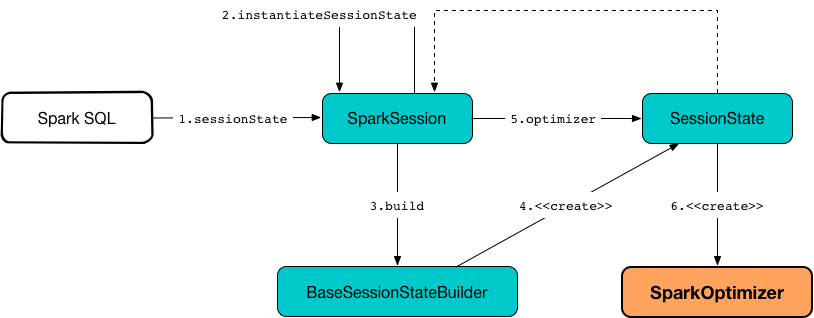

# SparkOptimizer &mdash; Logical Query Plan Optimizer

`SparkOptimizer` is a concrete [logical query plan optimizer](catalyst/Optimizer.md).

`SparkOptimizer` offers the following extension points for additional user-defined optimization rules:

* [Pre-Optimization Batches](#preOptimizationBatches)

* [Post-Hoc Optimization Batches](#postHocOptimizationBatches)

* [User Provided Optimizers](#User-Provided-Optimizers) (as [extraOptimizations](spark-sql-ExperimentalMethods.md#extraOptimizations) of the [ExperimentalMethods](#experimentalMethods))

## Creating Instance

`SparkOptimizer` takes the following to be created:

* <span id="catalogManager"> [CatalogManager](connector/catalog/CatalogManager.md)
* <span id="catalog"> [SessionCatalog](spark-sql-SessionCatalog.md)
* <span id="experimentalMethods"> [ExperimentalMethods](spark-sql-ExperimentalMethods.md)

`SparkOptimizer` is created when `SessionState` is requested for a [logical query plan optimizer](SessionState.md#optimizer) (indirectly using `BaseSessionStateBuilder` is requested for an [Optimizer](BaseSessionStateBuilder.md#optimizer)).



## <span id="earlyScanPushDownRules"> earlyScanPushDownRules

```scala
earlyScanPushDownRules: Seq[Rule[LogicalPlan]]
```

`earlyScanPushDownRules` defines the following rules:

* `SchemaPruning`
* `V2ScanRelationPushDown`
* [PruneFileSourcePartitions](logical-optimizations/PruneFileSourcePartitions.md)

`earlyScanPushDownRules` is part of the [Optimizer](catalyst/Optimizer.md) abstraction.

## <span id="defaultBatches"><span id="batches"> Default Rule Batches

`SparkOptimizer` overrides the [optimization rules](catalyst/Optimizer.md#defaultBatches).

### <span id="preOptimizationBatches"> Pre-Optimization Batches (Extension Point)

```scala
preOptimizationBatches: Seq[Batch]
```

Extension point for **Pre-Optimization Batches** that are executed first (before the regular optimization batches and the [defaultBatches](catalyst/Optimizer.md#defaultBatches)).

### Base Logical Optimization Batches

[Optimization rules](catalyst/Optimizer.md#defaultBatches) of the base [Logical Optimizer](catalyst/Optimizer.md)

### Optimize Metadata Only Query

Rules:

* [OptimizeMetadataOnlyQuery](logical-optimizations/OptimizeMetadataOnlyQuery.md)

Strategy: `Once`

### <span id="PartitionPruning"> PartitionPruning

Rules:

* [PartitionPruning](logical-optimizations/PartitionPruning.md)
* [OptimizeSubqueries](logical-optimizations/OptimizeSubqueries.md)

Strategy: `Once`

### Pushdown Filters from PartitionPruning

Rules:

* [PushDownPredicates](logical-optimizations/PushDownPredicates.md)

Strategy: [fixedPoint](catalyst/Optimizer.md#fixedPoint)

### Cleanup filters that cannot be pushed down

Rules:

* [CleanupDynamicPruningFilters](logical-optimizations/CleanupDynamicPruningFilters.md)
* [PruneFilters](logical-optimizations/PruneFilters.md)

Strategy: `Once`

### <span id="postHocOptimizationBatches"> Post-Hoc Optimization Batches (Extension Point)

```scala
postHocOptimizationBatches: Seq[Batch] = Nil
```

Extension point for **Post-Hoc Optimization Batches**

### Extract Python UDFs

Rules:

* `ExtractPythonUDFFromJoinCondition`
* `CheckCartesianProducts`
* [ExtractPythonUDFFromAggregate](logical-optimizations/ExtractPythonUDFFromAggregate.md)
* `ExtractGroupingPythonUDFFromAggregate`
* `ExtractPythonUDFs`
* `ColumnPruning`
* `PushPredicateThroughNonJoin`
* `RemoveNoopOperators`

Strategy: `Once`

### <span id="User-Provided-Optimizers"> User Provided Optimizers (Extension Point)

Extension point for [Extra Optimization Rules](spark-sql-ExperimentalMethods.md#extraOptimizations) using the given [ExperimentalMethods](#experimentalMethods)

Strategy: [fixedPoint](catalyst/Optimizer.md#fixedPoint)

## <span id="nonExcludableRules"> Non-Excludable Rules

`SparkOptimizer` considers `ExtractPythonUDFFromAggregate` optimization rule as [non-excludable](catalyst/Optimizer.md#nonExcludableRules).

## Accessing SparkOptimizer

`SparkOptimizer` is available as the [optimizer](SessionState.md#optimizer) property of a session-specific `SessionState`.

```scala
scala> :type spark
org.apache.spark.sql.SparkSession

scala> :type spark.sessionState.optimizer
org.apache.spark.sql.catalyst.optimizer.Optimizer

// It is a SparkOptimizer really.
// Let's check that out with a type cast

import org.apache.spark.sql.execution.SparkOptimizer
scala> spark.sessionState.optimizer.isInstanceOf[SparkOptimizer]
res1: Boolean = true
```

The optimized logical plan of a structured query is available as [QueryExecution.optimizedPlan](QueryExecution.md#optimizedPlan).

```text
// Applying two filter in sequence on purpose
// We want to kick CombineTypedFilters optimizer in
val dataset = spark.range(10).filter(_ % 2 == 0).filter(_ == 0)

// optimizedPlan is a lazy value
// Only at the first time you call it you will trigger optimizations
// Next calls end up with the cached already-optimized result
// Use explain to trigger optimizations again
scala> dataset.queryExecution.optimizedPlan
res0: org.apache.spark.sql.catalyst.plans.logical.LogicalPlan =
TypedFilter <function1>, class java.lang.Long, [StructField(value,LongType,true)], newInstance(class java.lang.Long)
+- Range (0, 10, step=1, splits=Some(8))
```

## Logging

Enable `ALL` logging level for `org.apache.spark.sql.execution.SparkOptimizer` logger to see what happens inside.

Add the following line to `conf/log4j.properties`:

```text
log4j.logger.org.apache.spark.sql.execution.SparkOptimizer=ALL
```

Refer to [Logging](spark-logging.md).

## <span id="i-want-more"> Further Reading and Watching

1. [Deep Dive into Spark SQL’s Catalyst Optimizer](https://databricks.com/blog/2015/04/13/deep-dive-into-spark-sqls-catalyst-optimizer.html)

2. (video) [Modern Spark DataFrame and Dataset (Intermediate Tutorial)](https://youtu.be/_1byVWTEK1s?t=19m7s) by [Adam Breindel](https://twitter.com/adbreind)
