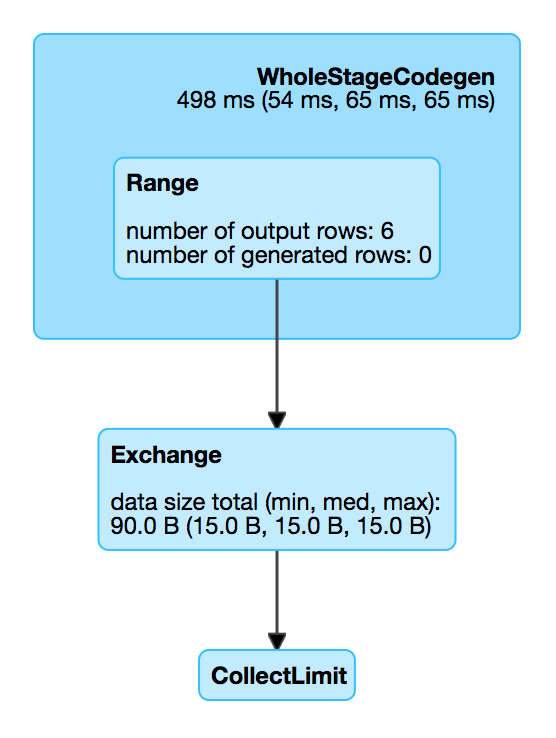

# ShuffleExchangeExec Unary Physical Operator

`ShuffleExchangeExec` is an [Exchange](Exchange.md) unary physical operator that is used to [perform a shuffle](#doExecute).

## Creating Instance

`ShuffleExchangeExec` takes the following to be created:

* <span id="outputPartitioning"> Output [Partitioning](Partitioning.md)
* <span id="child"> Child [physical operator](SparkPlan.md)
* <span id="canChangeNumPartitions"> `canChangeNumPartitions` flag (default: `true`)

`ShuffleExchangeExec` is created when:

* [BasicOperators](../execution-planning-strategies/BasicOperators.md) execution planning strategy is executed (and plans [Repartition](../logical-operators/Repartition-RepartitionByExpression.md) with the [shuffle](../logical-operators/Repartition-RepartitionByExpression.md#shuffle) flag enabled or [RepartitionByExpression](../logical-operators/Repartition-RepartitionByExpression.md))

* [EnsureRequirements](../physical-optimizations/EnsureRequirements.md) physical optimization is executed

## <span id="nodeName"> Node Name

```scala
nodeName: String
```

`nodeName` is always **Exchange**.

`nodeName` is part of the [TreeNode](../catalyst/TreeNode.md) abstraction.

## <span id="metrics"><span id="writeMetrics"><span id="readMetrics"> Performance Metrics

Key | Name (in web UI) | Description
---------|----------|---------
dataSize | data size |
fetchWaitTime | fetch wait time |
localBlocksFetched | local blocks read |
localBytesRead | local bytes read |
recordsRead | records read |
remoteBlocksFetched | remote blocks read |
remoteBytesRead | remote bytes read |
remoteBytesReadToDisk | remote bytes read to disk |
shuffleBytesWritten | shuffle bytes written |
shuffleRecordsWritten | shuffle records written |
shuffleWriteTime | shuffle write time |



## <span id="doExecute"> Executing Physical Operator

```scala
doExecute(): RDD[InternalRow]
```

`doExecute` gives a [ShuffledRowRDD](../ShuffledRowRDD.md) for the [ShuffleDependency](#shuffleDependency) and [read performance metrics](#readMetrics).

`doExecute` uses [cachedShuffleRDD](#cachedShuffleRDD) to avoid multiple execution.

`doExecute` is part of the [SparkPlan](SparkPlan.md#doExecute) abstraction.

## <span id="prepareShuffleDependency"> Creating ShuffleDependency

```scala
prepareShuffleDependency(
  rdd: RDD[InternalRow],
  outputAttributes: Seq[Attribute],
  newPartitioning: Partitioning,
  serializer: Serializer,
  writeMetrics: Map[String, SQLMetric]): ShuffleDependency[Int, InternalRow, InternalRow]
```

`prepareShuffleDependency` creates a Spark Core `ShuffleDependency` with a `RDD[Product2[Int, InternalRow]]` (where `Ints` are partition IDs of the `InternalRows` values) and the given `Serializer` (e.g. the <<serializer, Serializer>> of the `ShuffleExchangeExec` physical operator).

### <span id="prepareShuffleDependency-part"> Partitioner

`prepareShuffleDependency` determines a `Partitioner` based on the given `newPartitioning` [Partitioning](Partitioning.md):

* For [RoundRobinPartitioning](Partitioning.md#RoundRobinPartitioning), `prepareShuffleDependency` creates a `HashPartitioner` for the same number of partitions
* For [HashPartitioning](Partitioning.md#HashPartitioning), `prepareShuffleDependency` creates a `Partitioner` for the same number of partitions and `getPartition` that is an "identity"
* For [RangePartitioning](Partitioning.md#RangePartitioning), `prepareShuffleDependency` creates a `RangePartitioner` for the same number of partitions and `samplePointsPerPartitionHint` based on [spark.sql.execution.rangeExchange.sampleSizePerPartition](spark-sql-properties.md#spark.sql.execution.rangeExchange.sampleSizePerPartition) configuration property
* For [SinglePartition](Partitioning.md#SinglePartition), `prepareShuffleDependency` creates a `Partitioner` with `1` for the number of partitions and `getPartition` that always gives `0`

### <span id="prepareShuffleDependency-getPartitionKeyExtractor"> getPartitionKeyExtractor Internal Method

`prepareShuffleDependency` defines a `getPartitionKeyExtractor` method.

```scala
getPartitionKeyExtractor(): InternalRow => Any
```

`getPartitionKeyExtractor` uses the given `newPartitioning` [Partitioning](Partitioning.md):

* For [RoundRobinPartitioning](Partitioning.md#RoundRobinPartitioning),...FIXME
* For [HashPartitioning](Partitioning.md#HashPartitioning),...FIXME
* For [RangePartitioning](Partitioning.md#RangePartitioning),...FIXME
* For [SinglePartition](Partitioning.md#SinglePartition),...FIXME

### <span id="prepareShuffleDependency-isRoundRobin"> isRoundRobin Internal Flag

`prepareShuffleDependency` determines whether "this" is `isRoundRobin` or not based on the given `newPartitioning` partitioning. It is `isRoundRobin` when the partitioning is a `RoundRobinPartitioning` with more than one partition.

### <span id="prepareShuffleDependency-rddWithPartitionIds"> rddWithPartitionIds RDD

`prepareShuffleDependency` creates a `rddWithPartitionIds`:

1. Firstly, `prepareShuffleDependency` determines a `newRdd` based on `isRoundRobin` flag and [spark.sql.execution.sortBeforeRepartition](spark-sql-properties.md#spark.sql.execution.sortBeforeRepartition) configuration property. When both are enabled (`true`), `prepareShuffleDependency` sorts partitions (using a `UnsafeExternalRowSorter`) Otherwise, `prepareShuffleDependency` returns the given `RDD[InternalRow]` (unchanged).
1. Secondly, `prepareShuffleDependency` determines whether this is `isOrderSensitive` or not. This is `isOrderSensitive` when `isRoundRobin` flag is enabled (`true`) while [spark.sql.execution.sortBeforeRepartition](spark-sql-properties.md#spark.sql.execution.sortBeforeRepartition) configuration property is not (`false`).

`prepareShuffleDependency`...FIXME

### Usage

`prepareShuffleDependency` is used when:

* [CollectLimitExec](CollectLimitExec.md), <<doExecute, ShuffleExchangeExec>> and TakeOrderedAndProjectExec physical operators are executed

## <span id="serializer"> UnsafeRowSerializer

```scala
serializer: Serializer
```

`serializer` is an `UnsafeRowSerializer` with the following properties:

* Number of fields is the number of the [output attributes](../catalyst/QueryPlan.md#output) of the [child](#child) physical operator
* [dataSize](#metrics) performance metric

`serializer` is used when `ShuffleExchangeExec` operator is requested for a [ShuffleDependency](#shuffleDependency).

## <span id="cachedShuffleRDD"> ShuffledRowRDD

```scala
cachedShuffleRDD: ShuffledRowRDD
```

`cachedShuffleRDD` is an internal registry for the [ShuffledRowRDD](../ShuffledRowRDD.md) that `ShuffleExchangeExec` operator creates when [executed](#doExecute).

The purpose of `cachedShuffleRDD` is to avoid multiple [executions](#doExecute) of `ShuffleExchangeExec` operator when it is reused in a query plan:

* `cachedShuffleRDD` is uninitialized (`null`) when `ShuffleExchangeExec` operator is [created](#creating-instance)
* `cachedShuffleRDD` is assigned a `ShuffledRowRDD` when `ShuffleExchangeExec` operator is [executed](#doExecute) for the first time

## <span id="shuffleDependency"> ShuffleDependency

```scala
shuffleDependency: ShuffleDependency[Int, InternalRow, InternalRow]
```

`shuffleDependency` is a Spark Core `ShuffleDependency`.

??? note "shuffleDependency lazy value"
    `shuffleDependency` is a Scala lazy value which is computed once when accessed and cached afterwards.

`ShuffleExchangeExec` operator [creates a ShuffleDependency](#prepareShuffleDependency) for the following:

* [RDD[InternalRow]](#inputRDD)
* [Output attributes](../catalyst/QueryPlan.md#output) of the [child physical operator](#child)
* [Output partitioning](#outputPartitioning)
* [UnsafeRowSerializer](#serializer)
* [writeMetrics](#writeMetrics)

`shuffleDependency` is used when:

* [CustomShuffleReaderExec](CustomShuffleReaderExec.md) physical operator is executed
* [OptimizeLocalShuffleReader](../physical-optimizations/OptimizeLocalShuffleReader.md) is requested to `getPartitionSpecs`
* [OptimizeSkewedJoin](../physical-optimizations/OptimizeSkewedJoin.md) physical optimization is executed
* `ShuffleExchangeExec` physical operator is [executed](#doExecute) and requested for [MapOutputStatistics](#mapOutputStatisticsFuture)

## <span id="createShuffleWriteProcessor"> createShuffleWriteProcessor

```scala
createShuffleWriteProcessor(
  metrics: Map[String, SQLMetric]): ShuffleWriteProcessor
```

`createShuffleWriteProcessor` creates a Spark Core `ShuffleWriteProcessor` for the only reason to plug in a custom `ShuffleWriteMetricsReporter` (`SQLShuffleWriteMetricsReporter`).

`createShuffleWriteProcessor` is used when `ShuffleExchangeExec` operator is [executed](#doExecute) (and requested to [prepareShuffleDependency](#prepareShuffleDependency)).

## Demo

### ShuffleExchangeExec and Repartition Logical Operator

```text
val q = spark.range(6).repartition(2)
scala> q.explain(extended = true)
== Parsed Logical Plan ==
Repartition 2, true
+- Range (0, 6, step=1, splits=Some(16))

== Analyzed Logical Plan ==
id: bigint
Repartition 2, true
+- Range (0, 6, step=1, splits=Some(16))

== Optimized Logical Plan ==
Repartition 2, true
+- Range (0, 6, step=1, splits=Some(16))

== Physical Plan ==
Exchange RoundRobinPartitioning(2), false, [id=#8]
+- *(1) Range (0, 6, step=1, splits=16)
```

### ShuffleExchangeExec and RepartitionByExpression Logical Operator

```text
val q = spark.range(6).repartition(2, 'id % 2)
scala> q.explain(extended = true)
== Parsed Logical Plan ==
'RepartitionByExpression [('id % 2)], 2
+- Range (0, 6, step=1, splits=Some(16))

== Analyzed Logical Plan ==
id: bigint
RepartitionByExpression [(id#4L % cast(2 as bigint))], 2
+- Range (0, 6, step=1, splits=Some(16))

== Optimized Logical Plan ==
RepartitionByExpression [(id#4L % 2)], 2
+- Range (0, 6, step=1, splits=Some(16))

== Physical Plan ==
Exchange hashpartitioning((id#4L % 2), 2), false, [id=#17]
+- *(1) Range (0, 6, step=1, splits=16)
```
