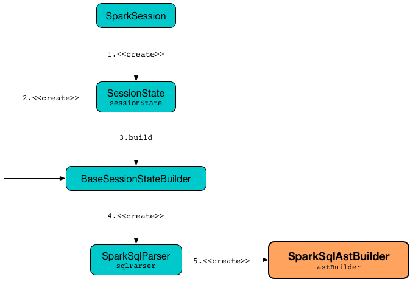

# SparkSqlAstBuilder &mdash; ANTLR-based SQL Parser

`SparkSqlAstBuilder` is an [AstBuilder](AstBuilder.md) that converts SQL statements into Catalyst expressions, logical plans or table identifiers (using [visit callbacks](#visit-callbacks)).

## Creating Instance

`SparkSqlAstBuilder` takes the following to be created:

* <span id="conf" /> [SQLConf](../spark-sql-SQLConf.md)

`SparkSqlAstBuilder` is created for [SparkSqlParser](SparkSqlParser.md#astBuilder) (which happens when `SparkSession` is requested for [SessionState](../SparkSession.md#sessionState)).



??? note "expr Standard Function"
    `SparkSqlAstBuilder` can also be temporarily created for [expr](../spark-sql-functions.md#expr) standard function (to create column expressions).

    ```
    val c = expr("from_json(value, schema)")
    scala> :type c
    org.apache.spark.sql.Column

    scala> :type c.expr
    org.apache.spark.sql.catalyst.expressions.Expression

    scala> println(c.expr.numberedTreeString)
    00 'from_json('value, 'schema)
    01 :- 'value
    02 +- 'schema
    ```

## Accessing SparkSqlAstBuilder

```
scala> :type spark.sessionState.sqlParser
org.apache.spark.sql.catalyst.parser.ParserInterface

import org.apache.spark.sql.execution.SparkSqlParser
val sqlParser = spark.sessionState.sqlParser.asInstanceOf[SparkSqlParser]

scala> :type sqlParser.astBuilder
org.apache.spark.sql.execution.SparkSqlAstBuilder
```

## Visit Callbacks

### <span id="ANALYZE-TABLE"/> visitAnalyze

Creates [AnalyzeColumnCommand](#AnalyzeColumnCommand), [AnalyzePartitionCommand](#AnalyzePartitionCommand) or [AnalyzeTableCommand](#AnalyzeTableCommand) logical commands.

ANTLR labeled alternative: `#analyze`

??? note "NOSCAN Identifier"
    <span id="ANALYZE-TABLE-NOSCAN"/>
    `visitAnalyze` supports `NOSCAN` identifier only (and reports a `ParseException` if not used).

    `NOSCAN` is used for `AnalyzePartitionCommand` and `AnalyzeTableCommand` logical commands only.

#### AnalyzeColumnCommand

[AnalyzeColumnCommand](../logical-operators/AnalyzeColumnCommand.md) logical command for `ANALYZE TABLE` with `FOR COLUMNS` clause (but no `PARTITION` specification)

```
// Seq((0, 0, "zero"), (1, 1, "one")).toDF("id", "p1", "p2").write.partitionBy("p1", "p2").saveAsTable("t1")
val sqlText = "ANALYZE TABLE t1 COMPUTE STATISTICS FOR COLUMNS id, p1"
val plan = spark.sql(sqlText).queryExecution.logical
import org.apache.spark.sql.execution.command.AnalyzeColumnCommand
val cmd = plan.asInstanceOf[AnalyzeColumnCommand]
scala> println(cmd)
AnalyzeColumnCommand `t1`, [id, p1]
```

#### AnalyzePartitionCommand

[AnalyzePartitionCommand](../logical-operators/AnalyzePartitionCommand.md) logical command for `ANALYZE TABLE` with `PARTITION` specification (but no `FOR COLUMNS` clause)

```
// Seq((0, 0, "zero"), (1, 1, "one")).toDF("id", "p1", "p2").write.partitionBy("p1", "p2").saveAsTable("t1")
val analyzeTable = "ANALYZE TABLE t1 PARTITION (p1, p2) COMPUTE STATISTICS"
val plan = spark.sql(analyzeTable).queryExecution.logical
import org.apache.spark.sql.execution.command.AnalyzePartitionCommand
val cmd = plan.asInstanceOf[AnalyzePartitionCommand]
scala> println(cmd)
AnalyzePartitionCommand `t1`, Map(p1 -> None, p2 -> None), false
```

#### AnalyzeTableCommand

[AnalyzeTableCommand](../logical-operators/AnalyzeTableCommand.md) logical command for `ANALYZE TABLE` with neither `PARTITION` specification nor `FOR COLUMNS` clause

```
// Seq((0, 0, "zero"), (1, 1, "one")).toDF("id", "p1", "p2").write.partitionBy("p1", "p2").saveAsTable("t1")
val sqlText = "ANALYZE TABLE t1 COMPUTE STATISTICS NOSCAN"
val plan = spark.sql(sqlText).queryExecution.logical
import org.apache.spark.sql.execution.command.AnalyzeTableCommand
val cmd = plan.asInstanceOf[AnalyzeTableCommand]
scala> println(cmd)
AnalyzeTableCommand `t1`, false
```

### visitGenericFileFormat

Creates a [CatalogStorageFormat](../spark-sql-CatalogStorageFormat.md) with the Hive SerDe for the data source name that can be one of the following (with their Hive-supported variants):

* `sequencefile`
* `rcfile`
* `orc`
* `parquet`
* `textfile`
* `avro`

### visitCacheTable

Creates a [CacheTableCommand](../logical-operators/RunnableCommand.md#CacheTableCommand) logical command for `CACHE LAZY? TABLE [table] (AS? [query])?`

ANTLR labeled alternative: `#cacheTable`

### visitCreateHiveTable

Creates a [CreateTable](../logical-operators/CreateTable.md)

ANTLR labeled alternative: `#createHiveTable`

### visitCreateTable

Creates one of the following logical operators:

* [CreateTable](../logical-operators/CreateTable.md) logical operator for `CREATE TABLE &hellip; AS &hellip;`

* [CreateTempViewUsing](../logical-operators/CreateTempViewUsing.md) logical operator for `CREATE TEMPORARY VIEW &hellip; USING &hellip;`

ANTLR labeled alternative: `#createTable`

### visitCreateView

Creates a [CreateViewCommand](../logical-operators/CreateViewCommand.md) for `CREATE VIEW AS` SQL statement.

```
CREATE [OR REPLACE] [[GLOBAL] TEMPORARY]
VIEW [IF NOT EXISTS] tableIdentifier
[identifierCommentList] [COMMENT STRING]
[PARTITIONED ON identifierList]
[TBLPROPERTIES tablePropertyList] AS query
```

ANTLR labeled alternative: `#createView`

### visitCreateTempViewUsing

Creates a [CreateTempViewUsing](../logical-operators/CreateTempViewUsing.md) for `CREATE TEMPORARY VIEW &hellip; USING`

ANTLR labeled alternative: `#createTempViewUsing`

### <span id="DESCRIBE"/> visitDescribeTable

Creates [DescribeColumnCommand](#DescribeColumnCommand) or [DescribeTableCommand](#DescribeTableCommand) logical commands.

ANTLR labeled alternative: `#describeTable`

#### DescribeColumnCommand

[DescribeColumnCommand](../logical-operators/DescribeColumnCommand.md) logical command for `DESCRIBE TABLE` with a single column only (i.e. no `PARTITION` specification).

```
// Seq((0, 0, "zero"), (1, 1, "one")).toDF("id", "p1", "p2").write.partitionBy("p1", "p2").saveAsTable("t1")
val sqlCmd = "DESC EXTENDED t1 p1"
val plan = spark.sql(sqlCmd).queryExecution.logical
import org.apache.spark.sql.execution.command.DescribeColumnCommand
val cmd = plan.asInstanceOf[DescribeColumnCommand]
scala> println(cmd)
DescribeColumnCommand `t1`, [p1], true
```

#### DescribeTableCommand

[DescribeTableCommand](../logical-operators/DescribeTableCommand.md) logical command for all other variants of `DESCRIBE TABLE` (i.e. no column)

```
// Seq((0, 0, "zero"), (1, 1, "one")).toDF("id", "p1", "p2").write.partitionBy("p1", "p2").saveAsTable("t1")
val sqlCmd = "DESC t1"
val plan = spark.sql(sqlCmd).queryExecution.logical
import org.apache.spark.sql.execution.command.DescribeTableCommand
val cmd = plan.asInstanceOf[DescribeTableCommand]
scala> println(cmd)
DescribeTableCommand `t1`, false
```

### visitShowCreateTable

Creates [ShowCreateTableCommand](../logical-operators/ShowCreateTableCommand.md) logical command for `SHOW CREATE TABLE` SQL statement.

```
SHOW CREATE TABLE tableIdentifier
```

ANTLR labeled alternative: `#showCreateTable`

### visitTruncateTable

Creates [TruncateTableCommand](../logical-operators/TruncateTableCommand.md) logical command for `TRUNCATE TABLE` SQL statement.

```
TRUNCATE TABLE tablename [PARTITION (partcol1=val1, partcol2=val2 ...)]
```

ANTLR labeled alternative: `#truncateTable`
